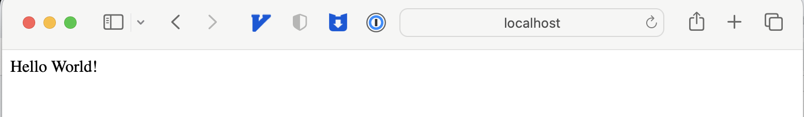
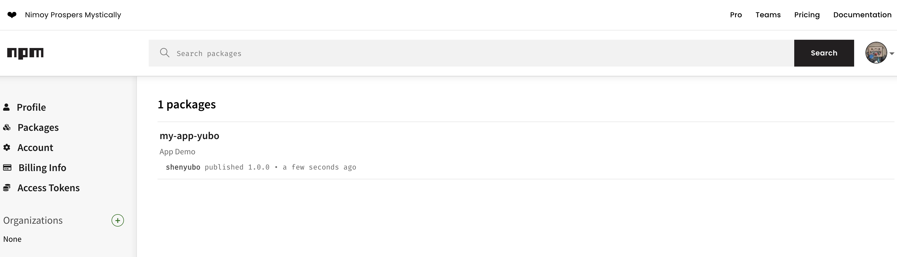

# TS Node.js 部署

## 创建一个TS Node.js应用

如果你已经熟悉创建TS Node.js项目，可以直接跳到“部署发布应用”部分

### 初始化Node.js项目：

在我们团队，我们非常喜欢TS，并且在我们的所有新项目中都会使用TS，因此创建一个TS项目并不新鲜。

让我们从最基本的开始：

1. `npm init` 初始化一个Node.js项目，使用`-y`参数可以快速跳过一步一步的配置
2. `npm install express @types/express` 安装express依赖，和用于TS开发的express的types类型文件
3. `npm install typescript --save-dev` 安装typescript作为开发依赖

```bash
mkdir my-app && cd my-app
npm init -y
npm install express @types/express --save
npm install typescript --save-dev

```

### TS配置

- `npx tsc --init` 将创建一个typescript默认配置文件tsconfig.json
- `declaration` 用于指定是否在编译完成后生成相应的*.d.ts文件，默认为false
- `outdir` 定义TS编译后的目录，如果没有声明，默认编译后的文件位置将和ts源文件在同一位置

运行命令

```bash
 npx tsc --init

```

修改以下配置

```json
"compilerOptions": {
  ...
  "outDir": "dist", // 编译后输出目录
  "declaration": true // 生成 d.ts
}

```

### 创建项目入口文件

创建`server.ts`文件

```typescript
import express from 'express'
const app = express()
const PORT = 3000

app.use(express.json())

app.get('/', (req, res) => {
  res.send(‘Hello World!’)
})

app.listen(PORT, () => {
  console.log(`Server is listening on port ${PORT}`)
})

```

完成上述步骤后，我们的文件目录结构如下

```go
.
├── node_modules
├── package-lock.json
├── package.json
├── server.ts
└── tsconfig.json

```

### 编译TS

我们下一步是构建和部署我们的TS Node.js应用，由于在生产环境中，我们不运行TS版本，而是运行编译后的JS。下面我们来编译项目

修改package.json文件增加以下命令

1. `npm run tsc` 将会根据我们tsconfig.json的配置编译我们的项目，并输出到指定目录
2. `npm run start:prod` 将会运行我们编译后的JS文件

```json
"scripts": {
  "tsc": "tsc",
  "start:prod": "node dist/server.js"
}

```

然后在本地进行测试

```bash
npm run tsc
npm run start:prod
# 服务启动成功，运行端口：3000
```

通过浏览器访问http://localhost:3000/



## 部署发布应用

这里我们主要采用两种方法将编译后的TS项目分发部署到各种环境中

- npm依赖包的形式
- docker容器方式

### NPM依赖包的形式

#### NPM生命周期钩子

一些特殊的生命周期钩子会在触发指定操作时被触发，这里我们将使用“prepare”钩子，该狗子会在执行npm publish命令发布到NPM之前被触发一次。所以我们可以这时编译的TS应用。

#### 指定发布文件

通过 “files”字段我们可以去定义发布NPM包时应该包括哪些文件，如果省略该属性默认会为["*"]，会上传所有文件。

下面是修改后的package.json

```json
"name": "my-app-xiaoshuai", // 我们发布到NPM上的名字
"main": "dist/server.js", // 修改入口文件地址
"types": "dist/server.d.ts", // 指定TS类型文件
"files": [
  "dist",
  "package.json",
  "package-lock.json",
  "README.md"
],
"scripts": {
  "tsc": "tsc",
  "prepare": "npm run tsc"  // 编辑typescript
}

```

#### npm publish

在修改完package.json配置后，我们运行npm publish命令，将我们的应用发布到NPM上去

```bash
npm publish
```

输出

如果npm publish 鉴权报错，运行并设置用户名密码

```bash
npm adduser
# 输入您相应的 Username 、 Password 、 Email: (this IS public)
```

发布成功后，可以看到npmjs上多了一个`my-app-xiaoshuai`包



### Docker容器方式

要将我们的TS Node.js应用作为容器发布，我们要在项目根目录中创建docker配置文件Dockerfile。

下面我们一步步编写Dockerfile文件

1. 拷贝编译后的文件到容器内
2. 拷贝package.json和package-lock.json到容器内
3. 使用 `npm install`安装依赖
4. 使用 `node build/server.js`运行我们的应用

```bash
# Node 版本
FROM node:14.18.0-alpine

ARG NODE_ENV=production
ENV NODE_ENV $NODE_ENV

COPY ./dist /dist
COPY ./package.json /package.json
COPY ./package-lock.json /package-lock.json

RUN NODE_ENV=$NODE_ENV npm install

EXPOSE 3000

CMD ["node", "dist/server.js"]

```

现在我们可以在根目录中构建docker镜像，运行 `docker build --tag my-app:test .` 命令

```bash
docker build --tag my-app:test .

```

成功后输出如下


接着我们运行容器，使用`docker run -p 3000:3000 -it my-app:test`命令来运行我们的应用，可以看到程序成功运行在3000端口

```bash
docker run -p 3000:3000 -it my-app:test
# 服务启动成功，运行端口：3000

```

通过浏览器访问 http://localhost:3000/

## 

## 总结

TS Node.js项目和部署它的基础知识
